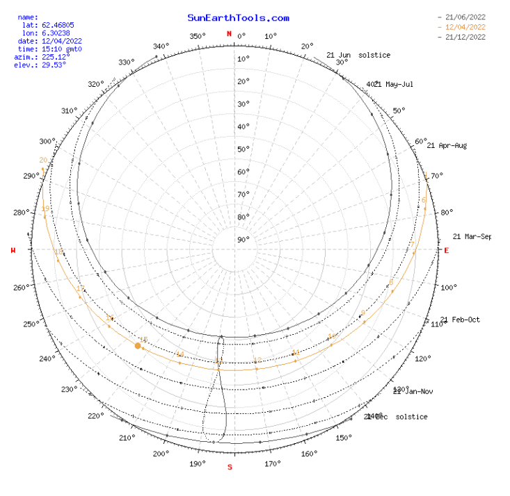

# On the Visualization of Spatiotemporal Urban Data

## Theory

In science, an inverse-square law is any scientific law stating that a specified physical quantity is inversely proportional to the square of the distance from the source of that physical quantity. In mathematical notation the inverse square law can be expressed as an intensity (I) varying as a function of distance (d) from some centre. The intensity is proportional to the multiplicative inverse of the square of the distance thus:
 
$$ intensity \propto \frac{1}{distance^2} $$

It can also be mathematically expressed as:

$$ \frac{intensity_1}{intensity_2} = \frac{distance_1^2}{distance_2^2} $$

To show this property, imagine a point light, like `S` in Fig. 1, while `r` represents the measured points. The lines represent the flux emitting from the sources and fluxes. The total number of flux lines depends on the strength of the light source and is constant with increasing distance, where a greater density of flux lines (lines per unit area) means a stronger energy field. The density of flux lines is inversely proportional to the square of the distance from the source because the surface area of a sphere increases with the square of the radius. Thus, the intensity of light from a point source (energy per unit of area perpendicular to the source) is inversely proportional to the square of the distance from the source, so an object twice as far away receives only one-quarter the energy (in the same time period).
<p align="center">

</p>
However, in computer graphics things are a little problem. As distance approaches zero, lighting intensity approaches infinity. To address this issue,there are several way but `Standard Unity rendering pipeline` uses a `fake falloff curve` derived from the following equation:
$$ \frac{1}{((\frac{x}{r}) . 5)^2 + 1 } $$
which `r` is `Range parameter`. It does in fact resemble the inverse square curve, except fixed at distance of 5 and then scaled based on Range parameter.
Since it is supposed to show `heatmap` on a specific point in the scene, we can use the main equations, because we do not need to compute the light intensity near the light source.
<p align="center">

</p>
To implement sun rising and sun setting for `Alesund`, a `directional lighting` element has been used. To calculate the exact position of `sun` for a city, we need three parameters, including `GPS coordinate`, `time zone` and `time`. Based on these parameters, two angles shown the position of sun at that specific time is derived. These angles are called `azimuth` and `elevation`. The position of sun for `Alesund` on 12 April 2022 was extracted from www.SunEarthTools.com website.
<p align="center">

</p>
In this part, the Cartesian coordinate of sun can be calculated as

$$ X = R \ . \ Cos ( Elevation) \ . \ Sin(Azimuth) $$

$$ Y = R \ . \ Sin \ (Elevation) $$

$$ Z = R \ . \ Cos ( Elevation) \ . \ Cos (Azimuth) $$

`R` is the distance of light source from the point. A large number is selected for this parameter. It is worth noting that the intensity of sun in any point changes related to `Elevation` angle. For instance, when this angle are 90 degree, the intensity of sun is in its maximum value. Thus, the amount of sun intensity in any point can be calculated as follow

$$ {Sun \ Intensity \ in \ any \ point  = Sun\ Intensity. \ Sin ( Elevation) \ } $$

To find the accumulated effect of `spot` lights, `Raycast` function is applied to show whether the light sources reach to the points or not. From each point of `Heatmap`, several rays cast towards light sources. Based on the distance between each point and the sources, Eq. 1, the light intensity is calculated for each point. It in worth noting that `maximum` and `minimum` values of each light in `Heatmap` is calculated as well to normalize the values of that light intensity. In other words, light intensity in each point can be calculated as   

$$ Intensity\ in\ a\ point = \frac{(\frac{intensity_{1}}{x_{1}^2}+\frac{intensity_{2}}{x_{2}^2}+...)- intensity_{min}}{intensity_{max}-intensity_{min}} $$

n= 1, 2, ..., n show the number of light and min and max illustrate the maximum and minimum values of accumulated light intensity of points used for normalizing values. The code is written for this part is shown in the following figure.    

```batch
foreach (barList item in cylinderGroup)
        {

            // ################### Light Intensity #################

            foreach (Quest mylight in StreetLight.listOfLights)
            {
                RaycastHit hit2;
                if (Physics.Raycast(item.myCylinderLoc, mylight.lightSourceLoc, out hit2, 1000f))
                {
                    float distance = (mylight.lightSourceLoc - item.myCylinderLoc).magnitude;
                    item.myLightsValue.Add(mylight.lightIntensity1 / (distance * distance));

                }

            }
            //Finding maximum and minimum values of accumulated light intensity in Heatmap
            if (item.myLightsValue.Sum() > MaxLights)
            {
                MaxLights = item.myLightsValue.Sum();
            }
            else if (item.myLightsValue.Sum() < MinLights)
            {
                MinLights = item.myLightsValue.Sum();
            }

        }


        //######## Normalizing accumulated lights intensity ##############
        foreach (barList item in cylinderGroup)
        {
            RaycastHit hit;

            if (InputMode.value == 1)
            {
                if (StreetLight.listOfLights.Any())
                {

                    foreach (Quest mylight in StreetLight.listOfLights)
                    {
                        Debug.DrawRay(item.myCylinder.transform.position, mylight.lightSourceLoc - item.myCylinderLoc, Color.green);
                    }
                    item.myOverallIntensity = (item.myLightsValue.Sum() - MinLights) / (MaxLights - MinLights);
                }
                else
                {
                    item.myOverallIntensity = 0;
                }

            }

            // ###################### Sun Intensity #################### 
            if (Physics.Raycast(item.myCylinderLoc, sun.transform.position, out hit, 1000f))
            {
                if (InputMode.value == 0)
                {
                    Debug.DrawRay(item.myCylinder.transform.position, sun.transform.position - item.myCylinder.transform.position, Color.blue);
                }
                item.mySunIntensity = Mathf.Abs(Mathf.Sin(mySun.transform.rotation.y));

            }
            else
            {
                if (InputMode.value == 0)
                {
                    item.mySunIntensity = 0;
                    Debug.DrawRay(item.myCylinder.transform.position, sun.transform.position - item.myCylinder.transform.position, Color.red);
                }
            }

            //Change the color of Heatmap
            if (InputMode.value == 0)
            {
                item.myOverallIntensity = item.mySunIntensity;

                // Change the color of heat map based on light intensity in an point 
                item.myColor = new Color(1 - item.myOverallIntensity, 0, item.myOverallIntensity);
                item.myCylinder.GetComponent<MeshRenderer>().material.color = item.myColor;
            }
            else
            {
                item.myColor = new Color(item.myOverallIntensity, 1 - item.myOverallIntensity, 0);
                item.myCylinder.GetComponent<MeshRenderer>().material.color = item.myColor;
            }
        }
    
```


## Result
The overall view of city simulator is shown in Fig. 4. There is a floating side bar designed to add and modify lights. As can be seen, two `drop down` menus are located in the side bar, the first one, `Mode`, is used to select between four modes, `Add Light/Camera`, `Edit Light`, `Edit Camera` and `Heatmap`, Fig. 5 (Right). There are four different types of street lights and CCTV in the second menu, `Type` menu, which can be located in the city simulator, Fig. 5 (left). Furthermore, There are two buttons for importing and exporting data as a \texttt{CSV} file.

<p align="center">

</p>
<p align="center">

</p>
After adding the lights by clicking on any point we want, Fig. 7,  or importing them from 'CSV' file, the features of each light can be modified. For doing this, 'Edit Light' mode must be selected from 'Mode' menu. In this mode, some input fields related to the lights are shown, Fig. 6. Then, we can select a light and change the features of 'Rotation', 'Intensity', 'Spot Angle', 'Range' and 'Color', Fig. 8.
<p align="center">

</p>

<p align="center">

</p>

<p align="center">

</p>

Figure 9 illustrate the heat map in a selected point. Given the sun and light intensity, the heat map can be calculated. As can be seen in the bottom of floating side bar, the dimensions of heat map can be changed to cover a bigger area.
<p align="center">

</p>

The effect of light intensity on heat maps is show in Fig. 10. It can be seen that points with shorter distances from both street lights receive higher intensity compared to points with more distance.
<p align="center">

</p>
